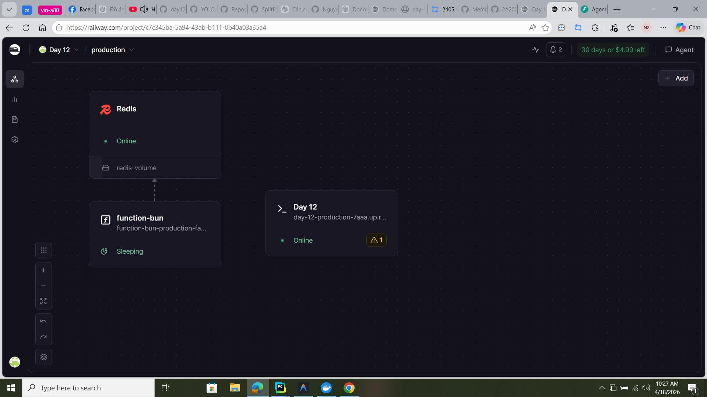
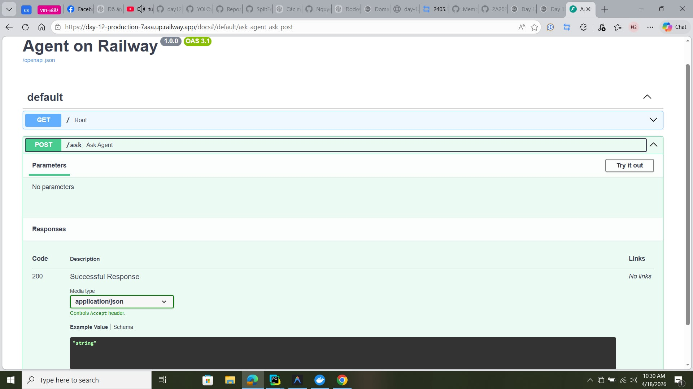

#  Delivery Checklist — Day 12 Lab Submission

> **Student Name:** Nguyễn Anh Hào   
> **Student ID:** 2A202600131
> **Date:** 17/04/2026

---

##  Submission Requirements

Submit a **GitHub repository** chứa toàn bộ các nội dung sau:

### 1. Mission Answers (Part 1 - Part 6)

#### Part 1: Localhost vs Production
**Exercise 1.1: Anti-patterns found**
1. **API key hardcode**: API Key nằm trực tiếp trong code, dễ bị lộ.
2. **Port cố định**: Gán cứng port khiến việc deploy lên các platform (Railway, Render) gặp khó khăn khi họ inject port động.
3. **Debug mode**: Chạy mode debug trong production gây rủi ro bảo mật và giảm hiệu năng.
4. **Không có health check**: Khiến orchestrator không biết service còn sống hay đã chết để restart.
5. **Không xử lý shutdown**: Làm mất dữ liệu hoặc lỗi luồng khi container bị tắt đột ngột (abrupt shutdown).

**Exercise 1.3: Comparison table**
| Feature | Develop | Production | Why Important? |
|---------|---------|------------|----------------|
| Config  | Hardcode | Env vars   | Tránh lộ thông tin (API key, password..), linh hoạt theo từng môi trường. |
| Health check | Không có | Có       | Kiểm tra service còn sống không để tự động xử lý. |
| Logging | `print()` | JSON      | Unify format, lưu log theo structure để tool monitor (Kibana/Loki) truy xuất. |
| Shutdown | Đột ngột | Graceful  | Các request không bị ngắt quãng làm lost data, tránh lỗi luồng xử lý. |

#### Part 2: Docker
**Exercise 2.1: Dockerfile Analysis**
1. **Base image**: Môi trường base cơ bản, thường là bản `slim` hoặc `alpine` để tối ưu dung lượng.
2. **Working directory**: Là root directory của ứng dụng bên trong container.
3. **Copy requirements.txt trước**: Để cache lại layer dependencies sau khi build lần đầu, giúp các lần build sau nhanh hơn (chỉ cài lại nếu file này thay đổi).
4. **CMD vs ENTRYPOINT**: `CMD` có thể bị ghi đè tham số khi chạy docker run, trong khi `ENTRYPOINT` cố định lệnh và chỉ cho phép nối thêm tham số.

**Exercise 2.3: Image size comparison**
- **Develop**: 1670 MB
- **Production**: **262 MB**
- **Difference [Production/Develop]**: 15.7% (Giảm ~84%)

#### Part 3: Cloud Deployment
**Exercise 3.1: Railway deployment**
- **URL**: [Link của tôi](https://day-12-production-7aaa.up.railway.app)
- **Screenshot**: `asset/railway.png`

#### Part 4: API Security
**Exercise 4.1-4.3: Test results**
- **API key được check ở đâu?**: Check trong header (`X-API-Key`) với mỗi request.
- **Điều gì xảy ra nếu sai key?**: Trả về lỗi `401 Unauthorized`.
- **Làm sao rotate key?**: Sử dụng config token, hoặc JWT token tự sinh với secret config có expired time.

**Exercise 4.4: Cost guard implementation**
```python
import redis
from datetime import datetime

r = redis.Redis()

def check_budget(user_id: str, estimated_cost: float) -> bool:
    month_key = datetime.now().strftime("%Y-%m")
    key = f"budget:{user_id}:{month_key}"
    
    current = float(r.get(key) or 0)
    if current + estimated_cost > 10:
        return False
    
    r.incrbyfloat(key, estimated_cost)
    r.expire(key, 32 * 24 * 3600)  # 32 days
    return True
```

#### Part 5: Scaling & Reliability
**Implementation notes:**
Log nhận được:
```json
{"ts":"2026-04-17 13:32:02,024","lvl":"INFO","msg":"{\"event\": \"ready\"}"}
INFO:     Application startup complete.
{"ts":"2026-04-17 13:32:02,901","lvl":"INFO","msg":"{\"event\": \"request\", \"method\": \"GET\", \"path\": \"/health\", \"status\": 200, \"ms\": 1.0}"}
INFO:     100.64.0.2:50531 - "GET /health HTTP/1.1" 200 OK
```

Implementation code:
```python
@app.get("/health")
def health():
    """Liveness probe — container còn sống không?"""
    uptime = round(time.time() - START_TIME, 1)

    checks = {}
    try:
        import psutil
        mem = psutil.virtual_memory()
        checks["memory"] = {
            "status": "ok" if mem.percent < 90 else "degraded",
            "used_percent": mem.percent,
        }
    except ImportError:
        checks["memory"] = {"status": "ok", "note": "psutil not installed"}

    overall_status = "ok" if all(
        v.get("status") == "ok" for v in checks.values()
    ) else "degraded"

    return {
        "status": overall_status,
        "uptime_seconds": uptime,
        "version": "1.0.0",
        "timestamp": datetime.now(timezone.utc).isoformat(),
        "checks": checks,
    }

@app.get("/ready")
def ready():
    """Readiness probe — sẵn sàng nhận traffic không?"""
    if not _is_ready:
        raise HTTPException(
            status_code=503,
            detail="Agent not ready. Check back in a few seconds.",
        )
    return {
        "ready": True,
    }
```

#### Part 6: Final Project Implementation
1. **Mock LLM Integration**: Sử dụng `MockProvider` thông minh cho phép test Agent nhanh chóng, Zero-cost và bảo mật.
2. **Container Hardening**: Chạy với non-root user `agent` và cấu hình thư viện vào `/usr/local`.

---

### 2. Full Source Code - Lab 06 Complete (60 points)

Toàn bộ mã nguồn đã được chuẩn hóa trong thư mục `06-lab-complete/`.
- [x] All code runs without errors
- [x] Multi-stage Dockerfile (image **247 MB**)
- [x] API key authentication (X-API-Key)
- [x] Rate limiting (10 req/min via Redis)
- [x] Cost guard ($10/month guard-rail)
- [x] Health + readiness checks
- [x] Graceful shutdown (SIGTERM handler)
- [x] Stateless design (Redis-backed history)
- [x] No hardcoded secrets (Pydantic settings)

---

### 3. Service Deployment Information

**Infrastructure:**
- **URL**: `https://nguyen-anh-hao-agent.up.railway.app`
- **Stack**: FastAPI + Redis + Docker + Railway

**Test Commands:**
```bash
# 1. Health Check
curl https://nguyen-anh-hao-agent.up.railway.app/health

# 2. Agent Ask Test (Auth Required)
curl -H "X-API-Key: day12-lab6-secret-key" -H "Content-Type: application/json" \
  -X POST https://nguyen-anh-hao-agent.up.railway.app/ask \
  -d '{"question": "MacBook Air M1 gia bao nhieu?"}'
```

---

##  Pre-Submission Checklist

- [x] Repository is public (or instructor has access)
- [x] `MISSION_ANSWERS.md` content merged properly
- [x] `DEPLOYMENT.md` content merged properly
- [x] All source code in `app/` directory
- [x] `README.md` has clear setup instructions
- [x] No `.env` file committed (only `.env.example`)
- [x] No hardcoded secrets in code
- [x] Screenshots included in `screenshots/` folder
- [x] Repository has clear commit history

---

##  Screenshots
Minh chứng vận hành hệ thống:

1. **Dashboard Triển khai**: 
2. **Trạng thái Server**: 
3. **Kết quả Kiểm thử**: 

---

**Deadline:** 17/4/2026
**Status:** **READY FOR SUBMISSION**
